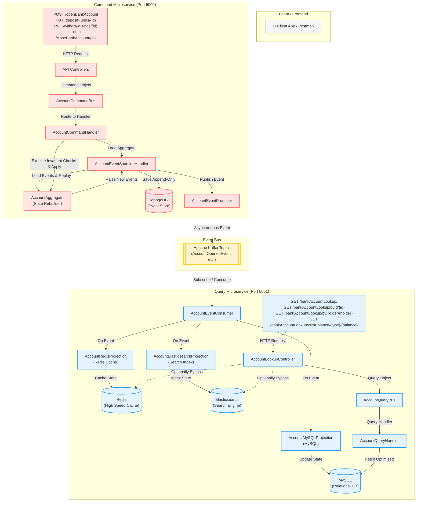

# 🏦 TechBank: Distributed Bank Account Management
### *An Enterprise-Grade Microservices Architecture built with Java 17, Spring Boot 3.4, CQRS, Event Sourcing, Apache Kafka, MongoDB, and MySQL*

---

[](https://openjdk.java.net/)
[](https://spring.io/projects/spring-boot)
[](https://kafka.apache.org/)
[](https://www.mongodb.com/)
[](https://www.mysql.com/)
[](#system-architecture)

Welcome to **TechBank**, a highly scalable, robust, and clean microservices-based Bank Account management system. This repository showcases a pure implementation of the **CQRS (Command Query Responsibility Segregation)** pattern coupled with **Event Sourcing (ES)**. 

Rather than storing the current state of a bank account directly, TechBank captures every single state transition as an immutable **Event** in an append-only event store (MongoDB), and asynchronously broadcasts these events via **Apache Kafka** to a highly optimized read database (MySQL) to serve fast query requests.

---

## 🗺️ System Architecture

The project is structured into a classic decoupled CQRS architecture, keeping write operations (Commands) completely independent of read operations (Queries).



### 🧠 Core Architectural Concepts Explained

*   **Command Query Responsibility Segregation (CQRS):** 
    *   **Write Side (`account-cmd`):** Optimised for transactional write speed, validating aggregate rules and appending events. It does *not* know how to query state; it only knows how to process actions.
    *   **Read Side (`account-query`):** Optimised for highly performant reads and search queries. It uses a standard relational database (MySQL) containing pre-computed data layouts to deliver immediate response times.
*   **Event Sourcing:** 
    *   Unlike traditional CRUD applications that perform `UPDATE` queries on rows, TechBank stores all historical actions (Events) in an append-only store (MongoDB). 
    *   To know the balance of an account, we read all historical events for that account identifier and **replay** them onto a fresh `AccountAggregate` object.
    *   This provides a 100% audit log, perfect compliance history, time-travel capabilities, and eliminates concurrency update issues.
*   **Kafka-Driven Event Synchronization:**
    *   Kafka acts as our distributed event backbone. As soon as events are safely saved to MongoDB, they are published to dedicated Kafka topics (e.g., `AccountOpenedEvent`, `FundsDepositedEvent`).
    *   The Read side consumes these events asynchronously, performing near-realtime updates in MySQL.
*   **Active Recovery & Event Replaying:**
    *   If the MySQL database is lost, corrupted, or schema changes occur, you can wipe the MySQL database entirely and issue a single POST request to the `/api/v1/restoreReadDb` endpoint on the command microservice.
    *   The system will fetch every single historical event from MongoDB, republish them to Kafka, and MySQL will be perfectly rebuilt to the current state!

---

## 📂 Project Structure & Module Directory

The codebase is organized as a multi-module Maven project to enforce strict decoupling and architectural boundaries:

```bash
bank-account-cqrs-event-sourcing-kafka-v1/
├── pom.xml                                # Parent Maven POM (defines dependencies/versions)
├── docker-compose.yml                     # Unified MongoDB + MySQL + Kafka + Zookeeper environment
├── cqrs/                                  # Core CQRS/Event Sourcing Abstraction Layer
│   ├── pom.xml
│   └── src/main/java/com/techbank/cqrs/
│       ├── commands/                      # Command abstractions (BaseCommand, Handler interfaces)
│       ├── queries/                       # Query abstractions (BaseQuery, Handler interfaces)
│       ├── events/                        # Event abstractions (BaseEvent)
│       ├── messages/                      # Message base class
│       ├── domain/                        # Core DDD classes (AggregateRoot, BaseEntity)
│       ├── exceptions/                    # System-wide exceptions (ConcurrencyException, etc.)
│       ├── infrastructure/                # Dispatchers and Event Store interface contracts
│       ├── producers/                     # Event Producer abstraction
│       └── model/                         # MongoDB EventModel and SnapshotModel document mapping
├── account-common/                        # Shared DTOs and Concrete Event definitions
│   ├── pom.xml
│   └── src/main/java/com/techbank/account/common/
│       ├── dto/                           # Shared classes (AccountType enum, BaseResponse)
│       └── events/                        # Main event structures (AccountOpenedEvent, FundsDepositedEvent, etc.)
├── account-cmd/                           # Write Service (Commands processor) - Port 5000
│   ├── pom.xml
│   └── src/main/java/com/techbank/account/cmd/
│       ├── AccountCmdApplication.java     # Entrypoint & @PostConstruct Handler registrations
│       ├── api/
│       │   ├── controllers/               # REST API endpoints (Open, Deposit, Withdraw, Close, Restore)
│       │   └── dto/                       # Service-specific response mappings (OpenAccountResponse)
│       ├── commands/
│       │   ├── account/                   # OpenAccountCommand, CloseAccountCommand
│       │   ├── fund/                      # DepositFundsCommand, WithdrawFundsCommand
│       │   ├── database/                  # RestoreReadDbCommand
│       │   └── handlers/                  # Business logic execution & state preservation handlers
│       ├── domain/                        # AccountAggregate & repositories (EventStoreRepository, SnapshotRepository)
│       ├── infrastructure/                # CommandBus, EventSourcingHandler, Producer, & MongoDB EventStore implementations
│       └── configuration/                 # Swagger/Spring OpenAPI setups
├── account-query/                         # Read Service (Queries processor) - Port 5001
│   ├── pom.xml
│   └── src/main/java/com/techbank/account/query/
│       ├── AccountQueryApplication.java   # Entrypoint & @PostConstruct Handler registrations
│       ├── api/
│       │   ├── controllers/               # REST API endpoints (Search by ID, Holder, Balance, or Get All)
│       │   ├── dto/                       # Response DTOs & EqualityType (GREATER_THAN, LESS_THAN)
│       │   └── queries/                   # FindAllAccountsQuery, FindAccountByIdQuery, FindAccountByHolderQuery, etc.
│       ├── domain/                        # BankAccount Entity (MySQL Jpa mapping) & AccountRepository
│       └── infrastructure/                # QueryBus, EventConsumer, & QueryHandler implementations
│           └── projections/               # AccountMySQLProjection, AccountRedisProjection, and AccountElasticsearchProjection implementations
└── infrastructure/                        # Docker & DevOps resources
    ├── pom.xml
    └── docker-compose/
        └── docker-compose.yml             # Old Local Kafka + Zookeeper environment
```

---

## 🛠️ Infrastructure & Environment Setup

TechBank's local infrastructure has been consolidated into a single unified `docker-compose.yml` file located in the root of the project. It launches all database dependencies, caches, search engines, and messaging systems (MongoDB, MySQL, Zookeeper, Kafka, Redis, and Elasticsearch) with a single command!

### Start the Infrastructure

Open a terminal in the root folder of the project (where `docker-compose.yml` is located) and run:
```bash
docker-compose up -d
```

This single command spins up:
1. **MongoDB** (Event Store & Snapshot Store) on port `27017`
2. **MySQL** (Read Database) on port `3306` (initialized with root password `root` and database `admin` - can be commented out in Compose if running natively on port `3306`)
3. **Zookeeper** & **Apache Kafka** (Event Broker) on port `9092` using Confluent's official stable images.
4. **Redis** (High-Speed Read Cache) on port `6379`
5. **Elasticsearch** (Full-Text Search Engine) on port `9200` (pre-configured with disabled security for easy developer testing)

*(To shut down the services, run `docker-compose down`.)*

---

## 🔌 API Endpoints Reference

### 1. Write Microservice (Command side - `account-cmd` @ Port `5000`)

#### 🔹 Open Bank Account
*   **Endpoint:** `POST /api/v1/openBankAccount`
*   **Headers:** `Content-Type: application/json`
*   **Request Payload:**
    ```json
    {
      "accountHolder": "Alice Vance",
      "accountType": "SAVINGS",
      "openingBalance": 250.00
    }
    ```
*   **Response (201 Created):**
    ```json
    {
      "message": "Bank account creation request completed successfully!",
      "id": "e96f1d2c-3987-43cf-be64-77e8ba0460c1"
    }
    ```
    *(Keep track of this generated UUID `id` to perform subsequent actions!)*

#### 🔹 Deposit Funds
*   **Endpoint:** `PUT /api/v1/depositFunds/{id}`
*   **Request Payload:**
    ```json
    {
      "amount": 150.00
    }
    ```
*   **Response (200 OK):**
    ```json
    {
      "message": "Deposit funds request completed successfully!"
    }
    ```

#### 🔹 Withdraw Funds
*   **Endpoint:** `PUT /api/v1/withdrawFunds/{id}`
*   **Request Payload:**
    ```json
    {
      "amount": 50.00
    }
    ```
*   **Response (200 OK):**
    ```json
    {
      "message": "Withdraw funds request completed successfully!"
    }
    ```
*   **Business Rule Enforcement (Example Exception):** If you attempt to withdraw more funds than your current aggregate balance, the system will return `400 Bad Request` with:
    ```json
    {
      "message": "java.lang.IllegalStateException: Withdrawal declined, insufficient funds!"
    }
    ```

#### 🔹 Close Bank Account
*   **Endpoint:** `DELETE /api/v1/closeBankAccount/{id}`
*   **Response (200 OK):**
    ```json
    {
      "message": "Bank account closure request successfully completed!"
    }
    ```

#### 🔹 Restore Read Database (Event Replay)
*   **Endpoint:** `POST /api/v1/restoreReadDb`
*   **Response (201 Created):**
    ```json
    {
      "message": "Read database restore request completed successfully!"
    }
    ```

---

### 2. Read Microservice (Query side - `account-query` @ Port `5001`)

#### 🔸 Get All Registered Accounts
*   **Endpoint:** `GET /api/v1/bankAccountLookup/`
*   **Response (200 OK):**
    ```json
    {
      "accounts": [
        {
          "id": "e96f1d2c-3987-43cf-be64-77e8ba0460c1",
          "accountHolder": "Alice Vance",
          "creationDate": "2026-05-17T01:23:45.000+00:00",
          "accountType": "SAVINGS",
          "balance": 350.00,
          "active": true
        }
      ],
      "message": "Successfully returned 1 bank account(s)!"
    }
    ```

#### 🔸 Get Account by ID
*   **Endpoint:** `GET /api/v1/bankAccountLookup/byId/{id}`
*   **Response (200 OK):**
    ```json
    {
      "accounts": [
        {
          "id": "e96f1d2c-3987-43cf-be64-77e8ba0460c1",
          "accountHolder": "Alice Vance",
          "creationDate": "2026-05-17T01:23:45.000+00:00",
          "accountType": "SAVINGS",
          "balance": 350.00,
          "active": true
        }
      ],
      "message": "Successfully returned bank account!"
    }
    ```

#### 🔸 Get Accounts by Account Holder
*   **Endpoint:** `GET /api/v1/bankAccountLookup/byHolder/{accountHolder}`
*   **Response (200 OK):**
    ```json
    {
      "accounts": [ ... ],
      "message": "Successfully returned bank account!"
    }
    ```

#### 🔸 Get Accounts with Balance Filters
Search for accounts having a balance strictly greater or less than a specified amount.
*   **Endpoint Options:** 
    *   `GET /api/v1/bankAccountLookup/withBalance/GREATER_THAN/{amount}`
    *   `GET /api/v1/bankAccountLookup/withBalance/LESS_THAN/{amount}`
*   **Sample URL:** `GET /api/v1/bankAccountLookup/withBalance/GREATER_THAN/100.00`
*   **Response (200 OK):**
    ```json
    {
      "accounts": [ ... ],
      "message": "Successfully returned 1 bank account(s)!"
    }
    ```

---

## 🚀 End-to-End Developer Testing Walkthrough

Follow these instructions to verify compile success, run both microservices locally, and test the entire CQRS/Event Sourcing cycle.

### 1. Build and Compile the Maven Project
In the root directory of the project, execute:
```bash
mvn clean install
```
This builds all 5 modules and creates compiling artifacts in their respective target directories.

### 2. Start the Write (Command) Microservice
Navigate to the `account-cmd` directory and run:
```bash
cd account-cmd
mvn spring-boot:run
```
> The command service starts on port `5000`. You can inspect the Swagger interface at [http://localhost:5000/swagger-ui/index.html](http://localhost:5000/swagger-ui/index.html).

### 3. Start the Read (Query) Microservice
Open a new terminal window, navigate to the `account-query` directory, and run:
```bash
cd account-query
mvn spring-boot:run
```
> The query service starts on port `5001`. You can inspect the Swagger interface at [http://localhost:5001/swagger-ui/index.html](http://localhost:5001/swagger-ui/index.html).

---

### 🧪 Integration Testing Checklist (Using cURL)

Ensure your infrastructure containers (Kafka, MongoDB, MySQL) are running!

#### Step A: Open a new account
```bash
curl -X POST http://localhost:5000/api/v1/openBankAccount \
  -H "Content-Type: application/json" \
  -d "{\"accountHolder\":\"John Doe\", \"accountType\":\"SAVINGS\", \"openingBalance\": 1000.00}"
```
*Note the returned `"id"` UUID (e.g. `e96f1d2c-3987-43cf-be64-77e8ba0460c1`).*

#### Step B: Deposit $500
```bash
curl -X PUT http://localhost:5000/api/v1/depositFunds/e96f1d2c-3987-43cf-be64-77e8ba0460c1 \
  -H "Content-Type: application/json" \
  -d "{\"amount\": 500.00}"
```

#### Step C: Withdraw $200
```bash
curl -X PUT http://localhost:5000/api/v1/withdrawFunds/e96f1d2c-3987-43cf-be64-77e8ba0460c1 \
  -H "Content-Type: application/json" \
  -d "{\"amount\": 200.00}"
```

#### Step D: Verify the updated balance in MySQL Read DB
```bash
curl -X GET http://localhost:5001/api/v1/bankAccountLookup/byId/e96f1d2c-3987-43cf-be64-77e8ba0460c1
```
> Balance returned should be exactly `$1300.00` ($1000 opening + $500 deposit - $200 withdrawal).

#### Step E: Trigger Database Restoration (Replaying Event Sourcing Stream)
To simulate database recovery:
1. Log in to **Adminer** (`http://localhost:8080/`) or use your MySQL CLI and delete all rows in the `bank_account` table:
   ```sql
   DELETE FROM bank_account;
   ```
2. Call the query side to check for contents:
   ```bash
   curl -X GET http://localhost:5001/api/v1/bankAccountLookup/
   ```
   > The query service returns `204 No Content` because MySQL has been wiped clean!
3. Now, issue the restore command to `account-cmd`:
   ```bash
   curl -X POST http://localhost:5000/api/v1/restoreReadDb
   ```
4. Immediately query the read service again:
   ```bash
   curl -X GET http://localhost:5001/api/v1/bankAccountLookup/byId/e96f1d2c-3987-43cf-be64-77e8ba0460c1
   ```
   > **Result:** The account is perfectly reconstructed, with the correct state, history, and balance of `$1300.00` re-synchronized!

---

## 🛡️ Enterprise-Grade Architectural Patterns Implemented

TechBank is built to demonstrate production-grade software craftsmanship, applying complex distributed systems patterns to achieve maximum reliability, throughput, and observability:

### 1. Pure CQRS (Command Query Responsibility Segregation)
- **Decoupled Workloads:** Completely splits the command (write) service from the query (read) service. They run as separate processes, scaling independently depending on throughput demands.
- **Optimized Data Representation:** The command model is optimized for transaction processing and business rules verification, while the read models (MySQL, Redis, Elasticsearch) are fully normalized and optimized for high-speed, query-specific indexing.

### 2. Append-Only Event Sourcing (ES)
- **Immutable Log:** Rather than storing current state, we record the delta transitions (e.g., `FundsDepositedEvent`) as immutable, append-only entries inside MongoDB.
- **Temporal Querying & Replay:** Enables recreating the exact state of any aggregate at any point in history ("time travel"), making debugging and auditing extremely robust.

### 3. Transactional Outbox Pattern (Gợi ý 1)
- **Reliable Publishing:** Solves the classic "dual-write problem". Instead of sending events directly to Kafka within the API handler thread (which risks inconsistent state if Kafka is slow or down), the write operation saves the event to the `domainEventEntry` collection and a pending message record to the `outbox_events` collection inside the same MongoDB transaction.
- **Asynchronous Background Scheduler:** A high-speed background worker (`OutboxPublisher`) runs every 500ms to poll pending events, send them to Kafka, and mark them as `PROCESSED`. If Kafka goes down, the api continues working smoothly, and events are automatically published once Kafka becomes available.

### 4. End-to-End Distributed Tracing (Gợi ý 2)
- **Context Propagation:** Tracks every bank transaction across multiple threads, databases, and network hops. An HTTP request coming to `account-cmd` is interceptor-wrapped to generate or extract an `X-Trace-Id`.
- **Kafka Header Propagation:** The `traceId` is bound to the thread's SLF4J `MDC` (Mapped Diagnostic Context), stored in MongoDB, and packed into the outgoing **Kafka Message Headers (`X-Trace-Id`)**.
- **Observability:** On the `account-query` side, the event consumer reads the Kafka header and sets MDC. In a production environment with tools like ELK or Kibana, developers can query a single `traceId` to view the entire life cycle of an action (from REST submission, MongoDB outbox saving, Kafka transmission, up to MySQL/Elasticsearch updates).

### 5. Idempotent Consumer & Event Sequence Validation
- **Out-of-Order Prevention:** Financial systems cannot afford out-of-order event processing. The Query consumer performs sequence validation before updating the MySQL relational model, comparing the event's `sequenceNumber` with the expected version.
- **Deduplication:** Prevents duplicate event processing (at-least-once Kafka delivery) by validating sequence numbers, ensuring absolute database consistency.

### 6. High-Performance State Snapshotting
- **State Restoring Optimization:** Replaying thousands of events to rebuild an aggregate state wastes CPU cycles. When an aggregate's version reaches a multiple of 3 (e.g., 3, 6, 9), a full JSON state snapshot is written to the `snapshots` collection.
- **Speedy Reconstruction:** The event sourcing handler loads the latest snapshot first and only replays subsequent events, maintaining sub-millisecond aggregate reconstruction times regardless of stream size.

### 7. Polyglot Persistence Read-Projections
- **Relational Reporting (MySQL):** The event listener updates the MySQL database to serve transactional lookup queries.
- **Ultra-Fast Cache (Redis):** The listener updates a high-speed Redis JSON cache with a 7-day TTL, enabling bypass query lookups under extremely high traffic.
- **Full-Text Search Engine (Elasticsearch):** Events are indexed into Elasticsearch, enabling sub-millisecond, complex full-text search capability.

### 8. Resilience with Retry Topics & Dead Letter Queue (DLQ/DLT)
- **Fault-Tolerance:** If a consumer fails to process a message due to a database lock or temporal issue, Kafka automatically retries up to 3 times using exponential backoff (e.g., 1s, 2s, 4s).
- **Non-blocking Pipelines:** If the event fails all retries, it is automatically routed to a dead letter topic (`-dlt`) to allow manual inspection without blocking the rest of the message pipeline.

---

## 🏦 Real-World Production Usecases Solved

### 1. High-Frequency Concurrent Account Transfers (No Relational Locks)
In standard CRUD apps, concurrent transfers require heavy database locks (`SELECT ... FOR UPDATE`), causing high latency and deadlocks. TechBank uses **Optimistic Concurrency Control (OCC)** based on sequence numbers. Multiple concurrent requests proceed in parallel without locks. If a collision occurs, the system safely rejects the invalid transaction at the event-store level, guaranteeing data integrity at scale.

### 2. Perfect Regulatory Compliance & Immutable Auditing
Under international banking laws (like SOX or GDPR), ledger alterations are strictly prohibited. Because TechBank uses Event Sourcing, the transaction history is mathematically complete and append-only. There are no SQL `UPDATE` or `DELETE` statements on the ledger. This guarantees a mathematically verifiable, 100% audit log for compliance.

### 3. Non-Disruptive Data Migrations & Schema Changes
If you decide to migrate from MySQL to PostgreSQL or change the database schemas in the future, you do not need to perform high-risk SQL database migrations. Since the event log (MongoDB) contains all historical truth, you can spin up your new database, start a new consumer projection, and **replay the entire event stream from year 1** to populate the new system without any downtime.

### 4. Multi-Tenant Real-Time Financial Dashboards
Combining MySQL, Redis, and Elasticsearch allows immediate reporting. Executive dashboards query Elasticsearch for instantaneous aggregation of total regional deposits, customers retrieve sub-millisecond account status from the Redis cache, and accounting runs complex reports directly on MySQL without any resource contention.

---

## 🔒 OpenAPI 3.0 Documentation

Comprehensive, automated, interactive APIs are self-documented via Springdoc Swagger UI, offering effortless frontend integration:
- Command Swagger UI: `http://localhost:5000/swagger-ui/index.html`
- Query Swagger UI: `http://localhost:5001/swagger-ui/index.html`

