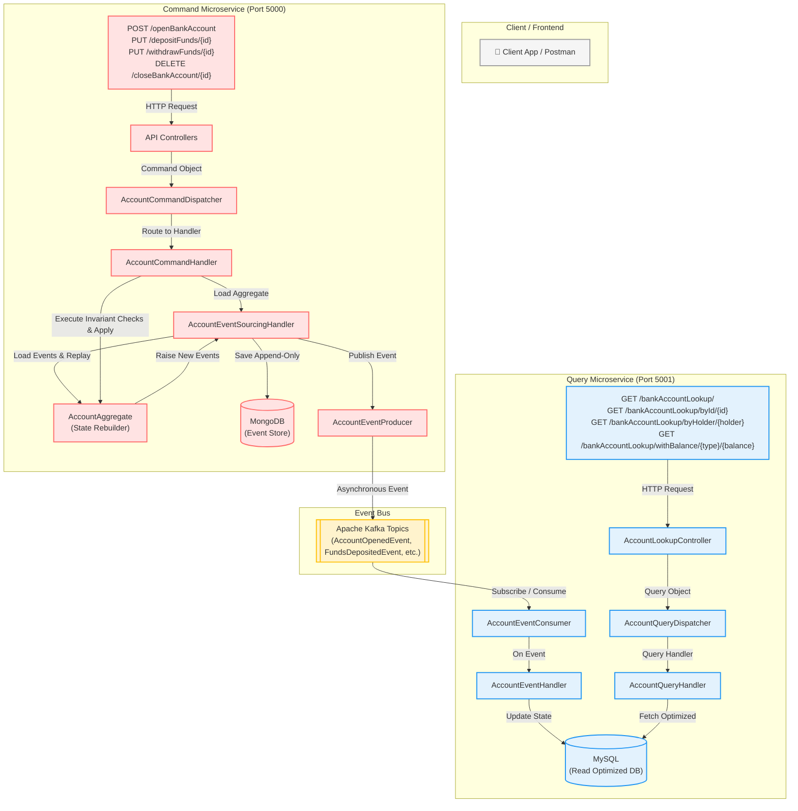

# 🏦 TechBank: Distributed Bank Account Management
### *An Enterprise-Grade Microservices Architecture built with Java 17, Spring Boot 3.4, CQRS, Event Sourcing, Apache Kafka, MongoDB, and MySQL*

---

[](https://openjdk.java.net/)
[](https://spring.io/projects/spring-boot)
[](https://kafka.apache.org/)
[](https://www.mongodb.com/)
[](https://www.mysql.com/)
[](#system-architecture)

Welcome to **TechBank**, a highly scalable, robust, and clean microservices-based Bank Account management system. This repository showcases a pure implementation of the **CQRS (Command Query Responsibility Segregation)** pattern coupled with **Event Sourcing (ES)**. 

Rather than storing the current state of a bank account directly, TechBank captures every single state transition as an immutable **Event** in an append-only event store (MongoDB), and asynchronously broadcasts these events via **Apache Kafka** to a highly optimized read database (MySQL) to serve fast query requests.

---

## 🗺️ System Architecture

The project is structured into a classic decoupled CQRS architecture, keeping write operations (Commands) completely independent of read operations (Queries).



### 🧠 Core Architectural Concepts Explained

*   **Command Query Responsibility Segregation (CQRS):** 
    *   **Write Side (`account-cmd`):** Optimised for transactional write speed, validating aggregate rules and appending events. It does *not* know how to query state; it only knows how to process actions.
    *   **Read Side (`account-query`):** Optimised for highly performant reads and search queries. It uses a standard relational database (MySQL) containing pre-computed data layouts to deliver immediate response times.
*   **Event Sourcing:** 
    *   Unlike traditional CRUD applications that perform `UPDATE` queries on rows, TechBank stores all historical actions (Events) in an append-only store (MongoDB). 
    *   To know the balance of an account, we read all historical events for that account identifier and **replay** them onto a fresh `AccountAggregate` object.
    *   This provides a 100% audit log, perfect compliance history, time-travel capabilities, and eliminates concurrency update issues.
*   **Kafka-Driven Event Synchronization:**
    *   Kafka acts as our distributed event backbone. As soon as events are safely saved to MongoDB, they are published to dedicated Kafka topics (e.g., `AccountOpenedEvent`, `FundsDepositedEvent`).
    *   The Read side consumes these events asynchronously, performing near-realtime updates in MySQL.
*   **Active Recovery & Event Replaying:**
    *   If the MySQL database is lost, corrupted, or schema changes occur, you can wipe the MySQL database entirely and issue a single POST request to the `/api/v1/restoreReadDb` endpoint on the command microservice.
    *   The system will fetch every single historical event from MongoDB, republish them to Kafka, and MySQL will be perfectly rebuilt to the current state!

---

## 📂 Project Structure & Module Directory

The codebase is organized as a multi-module Maven project to enforce strict decoupling and architectural boundaries:

```bash
bank-account-cqrs-event-sourcing-kafka-v1/
├── pom.xml                                # Parent Maven POM (defines dependencies/versions)
├── cqrs/                                  # Core CQRS/Event Sourcing Abstraction Layer
│   ├── pom.xml
│   └── src/main/java/com/techbank/cqrs/
│       ├── commands/                      # Command abstractions (BaseCommand, Handler interfaces)
│       ├── queries/                       # Query abstractions (BaseQuery, Handler interfaces)
│       ├── events/                        # Event abstractions (BaseEvent)
│       ├── messages/                      # Message base class
│       ├── domain/                        # Core DDD classes (AggregateRoot, BaseEntity)
│       ├── exceptions/                    # System-wide exceptions (ConcurrencyException, etc.)
│       ├── infrastructure/                # Dispatchers and Event Store interface contracts
│       ├── producers/                     # Event Producer abstraction
│       └── model/                         # MongoDB Event Model document mapping
├── account-common/                        # Shared DTOs and Concrete Event definitions
│   ├── pom.xml
│   └── src/main/java/com/techbank/account/common/
│       ├── dto/                           # Shared classes (AccountType enum, BaseResponse)
│       └── events/                        # Main event structures (AccountOpenedEvent, FundsDepositedEvent, etc.)
├── account-cmd/                           # Write Service (Commands processor) - Port 5000
│   ├── pom.xml
│   └── src/main/java/com/techbank/account/cmd/
│       ├── AccountCmdApplication.java     # Entrypoint & @PostConstruct Handler registrations
│       ├── api/
│       │   ├── controllers/               # REST API endpoints (Open, Deposit, Withdraw, Close, Restore)
│       │   └── dto/                       # Service-specific response mappings (OpenAccountResponse)
│       ├── commands/
│       │   ├── account/                   # OpenAccountCommand, CloseAccountCommand
│       │   ├── fund/                      # DepositFundsCommand, WithdrawFundsCommand
│       │   ├── database/                  # RestoreReadDbCommand
│       │   └── handlers/                  # Business logic execution & state preservation handlers
│       ├── domain/                        # AccountAggregate (state rules & reflection apply methods)
│       ├── infrastructure/                # CommandDispatcher, EventSourcingHandler, Producer, & MongoDB EventStore implementations
│       └── configuration/                 # Swagger/Spring OpenAPI setups
├── account-query/                         # Read Service (Queries processor) - Port 5001
│   ├── pom.xml
│   └── src/main/java/com/techbank/account/query/
│       ├── AccountQueryApplication.java   # Entrypoint & @PostConstruct Handler registrations
│       ├── api/
│       │   ├── controllers/               # REST API endpoints (Search by ID, Holder, Balance, or Get All)
│       │   ├── dto/                       # Response DTOs & EqualityType (GREATER_THAN, LESS_THAN)
│       │   └── queries/                   # FindAllAccountsQuery, FindAccountByIdQuery, QueryHandler definitions
│       ├── domain/                        # BankAccount Entity (MySQL Jpa mapping) & AccountRepository
│       ├── infrastructure/                # QueryDispatcher, EventConsumer, & EventHandler implementations
│       └── configuration/                 # Swagger configurations
└── infrastructure/                        # Docker & DevOps resources
    ├── pom.xml
    └── docker-compose/
        └── docker-compose.yml             # Local Kafka + Zookeeper environment
```

---

## 🛠️ Infrastructure & Environment Setup

To run TechBank, you need to spin up the infrastructure dependencies: **Apache Kafka + Zookeeper**, **MongoDB** (Event Store), **MySQL** (Read Database), and **Adminer** (GUI for database administration). 

We will place them all on a shared docker bridge network called `techbankNet` so they can communicate seamlessly.

### Step 1: Create the Docker Network
```bash
docker network create --attachable -d bridge techbankNet
```

### Step 2: Start Kafka & Zookeeper
Navigate to the docker-compose folder and start the services:
```bash
cd infrastructure/docker-compose
docker-compose up -d
```
> This starts Zookeeper on port `2181` and Apache Kafka on port `9092`.

### Step 3: Start MongoDB (Event Store)
Run the MongoDB container on the `techbankNet` network:
```bash
docker run -it -d --name mongo-container \
  -p 27017:27017 \
  --network techbankNet \
  --restart always \
  -v mongodb_data_container:/data/db \
  mongo:latest
```
> Connects on port `27017`. MongoDB will store all structural event models.

### Step 4: Start MySQL (Read Optimized DB)
Run the MySQL container on the `techbankNet` network with the required credentials:
```bash
docker run -it -d --name mysql-container \
  -p 3306:3306 \
  --network techbankNet \
  -e MYSQL_ROOT_PASSWORD=techbankRootPsw \
  --restart always \
  -v mysql_data_container:/var/lib/mysql \
  mysql:latest
```
> Connects on port `3306`. The databases and tables will be generated automatically on startup by Spring Data JPA.

### Step 5: Start Adminer (Optional Visual SQL GUI)
For a visual browser dashboard to inspect MySQL, run Adminer connected to the MySQL container:
```bash
docker run -it -d --name adminer \
  -p 8080:8080 \
  --network techbankNet \
  -e ADMINER_DEFAULT_SERVER=mysql-container \
  --restart always \
  adminer:latest
```
> Access Adminer at [http://localhost:8080/](http://localhost:8080/). Log in with server: `mysql-container`, username: `root`, password: `techbankRootPsw`.

---

## 🔌 API Endpoints Reference

### 1. Write Microservice (Command side - `account-cmd` @ Port `5000`)

#### 🔹 Open Bank Account
*   **Endpoint:** `POST /api/v1/openBankAccount`
*   **Headers:** `Content-Type: application/json`
*   **Request Payload:**
    ```json
    {
      "accountHolder": "Alice Vance",
      "accountType": "SAVINGS",
      "openingBalance": 250.00
    }
    ```
*   **Response (201 Created):**
    ```json
    {
      "message": "Bank account creation request completed successfully!",
      "id": "e96f1d2c-3987-43cf-be64-77e8ba0460c1"
    }
    ```
    *(Keep track of this generated UUID `id` to perform subsequent actions!)*

#### 🔹 Deposit Funds
*   **Endpoint:** `PUT /api/v1/depositFunds/{id}`
*   **Request Payload:**
    ```json
    {
      "amount": 150.00
    }
    ```
*   **Response (200 OK):**
    ```json
    {
      "message": "Deposit funds request completed successfully!"
    }
    ```

#### 🔹 Withdraw Funds
*   **Endpoint:** `PUT /api/v1/withdrawFunds/{id}`
*   **Request Payload:**
    ```json
    {
      "amount": 50.00
    }
    ```
*   **Response (200 OK):**
    ```json
    {
      "message": "Withdraw funds request completed successfully!"
    }
    ```
*   **Business Rule Enforcement (Example Exception):** If you attempt to withdraw more funds than your current aggregate balance, the system will return `400 Bad Request` with:
    ```json
    {
      "message": "java.lang.IllegalStateException: Withdrawal declined, insufficient funds!"
    }
    ```

#### 🔹 Close Bank Account
*   **Endpoint:** `DELETE /api/v1/closeBankAccount/{id}`
*   **Response (200 OK):**
    ```json
    {
      "message": "Bank account closure request successfully completed!"
    }
    ```

#### 🔹 Restore Read Database (Event Replay)
*   **Endpoint:** `POST /api/v1/restoreReadDb`
*   **Response (201 Created):**
    ```json
    {
      "message": "Read database restore request completed successfully!"
    }
    ```

---

### 2. Read Microservice (Query side - `account-query` @ Port `5001`)

#### 🔸 Get All Registered Accounts
*   **Endpoint:** `GET /api/v1/bankAccountLookup/`
*   **Response (200 OK):**
    ```json
    {
      "accounts": [
        {
          "id": "e96f1d2c-3987-43cf-be64-77e8ba0460c1",
          "accountHolder": "Alice Vance",
          "creationDate": "2026-05-17T01:23:45.000+00:00",
          "accountType": "SAVINGS",
          "balance": 350.00,
          "active": true
        }
      ],
      "message": "Successfully returned 1 bank account(s)!"
    }
    ```

#### 🔸 Get Account by ID
*   **Endpoint:** `GET /api/v1/bankAccountLookup/byId/{id}`
*   **Response (200 OK):**
    ```json
    {
      "accounts": [
        {
          "id": "e96f1d2c-3987-43cf-be64-77e8ba0460c1",
          "accountHolder": "Alice Vance",
          "creationDate": "2026-05-17T01:23:45.000+00:00",
          "accountType": "SAVINGS",
          "balance": 350.00,
          "active": true
        }
      ],
      "message": "Successfully returned bank account!"
    }
    ```

#### 🔸 Get Accounts by Account Holder
*   **Endpoint:** `GET /api/v1/bankAccountLookup/byHolder/{accountHolder}`
*   **Response (200 OK):**
    ```json
    {
      "accounts": [ ... ],
      "message": "Successfully returned bank account!"
    }
    ```

#### 🔸 Get Accounts with Balance Filters
Search for accounts having a balance strictly greater or less than a specified amount.
*   **Endpoint Options:** 
    *   `GET /api/v1/bankAccountLookup/withBalance/GREATER_THAN/{amount}`
    *   `GET /api/v1/bankAccountLookup/withBalance/LESS_THAN/{amount}`
*   **Sample URL:** `GET /api/v1/bankAccountLookup/withBalance/GREATER_THAN/100.00`
*   **Response (200 OK):**
    ```json
    {
      "accounts": [ ... ],
      "message": "Successfully returned 1 bank account(s)!"
    }
    ```

---

## 🚀 End-to-End Developer Testing Walkthrough

Follow these instructions to verify compile success, run both microservices locally, and test the entire CQRS/Event Sourcing cycle.

### 1. Build and Compile the Maven Project
In the root directory of the project, execute:
```bash
mvn clean install
```
This builds all 5 modules and creates compiling artifacts in their respective target directories.

### 2. Start the Write (Command) Microservice
Navigate to the `account-cmd` directory and run:
```bash
cd account-cmd
mvn spring-boot:run
```
> The command service starts on port `5000`. You can inspect the Swagger interface at [http://localhost:5000/swagger-ui/index.html](http://localhost:5000/swagger-ui/index.html).

### 3. Start the Read (Query) Microservice
Open a new terminal window, navigate to the `account-query` directory, and run:
```bash
cd account-query
mvn spring-boot:run
```
> The query service starts on port `5001`. You can inspect the Swagger interface at [http://localhost:5001/swagger-ui/index.html](http://localhost:5001/swagger-ui/index.html).

---

### 🧪 Integration Testing Checklist (Using cURL)

Ensure your infrastructure containers (Kafka, MongoDB, MySQL) are running!

#### Step A: Open a new account
```bash
curl -X POST http://localhost:5000/api/v1/openBankAccount \
  -H "Content-Type: application/json" \
  -d "{\"accountHolder\":\"John Doe\", \"accountType\":\"SAVINGS\", \"openingBalance\": 1000.00}"
```
*Note the returned `"id"` UUID (e.g. `e96f1d2c-3987-43cf-be64-77e8ba0460c1`).*

#### Step B: Deposit $500
```bash
curl -X PUT http://localhost:5000/api/v1/depositFunds/e96f1d2c-3987-43cf-be64-77e8ba0460c1 \
  -H "Content-Type: application/json" \
  -d "{\"amount\": 500.00}"
```

#### Step C: Withdraw $200
```bash
curl -X PUT http://localhost:5000/api/v1/withdrawFunds/e96f1d2c-3987-43cf-be64-77e8ba0460c1 \
  -H "Content-Type: application/json" \
  -d "{\"amount\": 200.00}"
```

#### Step D: Verify the updated balance in MySQL Read DB
```bash
curl -X GET http://localhost:5001/api/v1/bankAccountLookup/byId/e96f1d2c-3987-43cf-be64-77e8ba0460c1
```
> Balance returned should be exactly `$1300.00` ($1000 opening + $500 deposit - $200 withdrawal).

#### Step E: Trigger Database Restoration (Replaying Event Sourcing Stream)
To simulate database recovery:
1. Log in to **Adminer** (`http://localhost:8080/`) or use your MySQL CLI and delete all rows in the `bank_account` table:
   ```sql
   DELETE FROM bank_account;
   ```
2. Call the query side to check for contents:
   ```bash
   curl -X GET http://localhost:5001/api/v1/bankAccountLookup/
   ```
   > The query service returns `204 No Content` because MySQL has been wiped clean!
3. Now, issue the restore command to `account-cmd`:
   ```bash
   curl -X POST http://localhost:5000/api/v1/restoreReadDb
   ```
4. Immediately query the read service again:
   ```bash
   curl -X GET http://localhost:5001/api/v1/bankAccountLookup/byId/e96f1d2c-3987-43cf-be64-77e8ba0460c1
   ```
   > **Result:** The account is perfectly reconstructed, with the correct state, history, and balance of `$1300.00` re-synchronized!

---

## 🔒 Security & Best Practices Implemented

1.  **Optimistic Concurrency Control:** Implemented version verification inside `AccountEventStore` (`saveEvents`) to guarantee that events are appended sequentially. If concurrent threads attempt to modify an aggregate based on an outdated state version, a `ConcurrencyException` is thrown, preventing race conditions.
2.  **Strict Decoupling (Pure Abstraction):** The `cqrs` package has zero compile-time dependencies on concrete bank account schemas, ensuring it can easily be compiled as an independent reusable library.
3.  **Manual Kafka Acknowledgments:** Event Consumers on the read side are set to `MANUAL_IMMEDIATE` acknowledgement mode, ensuring events are acknowledged *only* after they are successfully processed and committed to the read database, guaranteeing **at-least-once delivery semantics**.
4.  **OpenAPI 3.0 Documentation:** Comprehensive, automated, interactive APIs are self-documented via Springdoc Swagger UI, offering effortless frontend onboarding.
